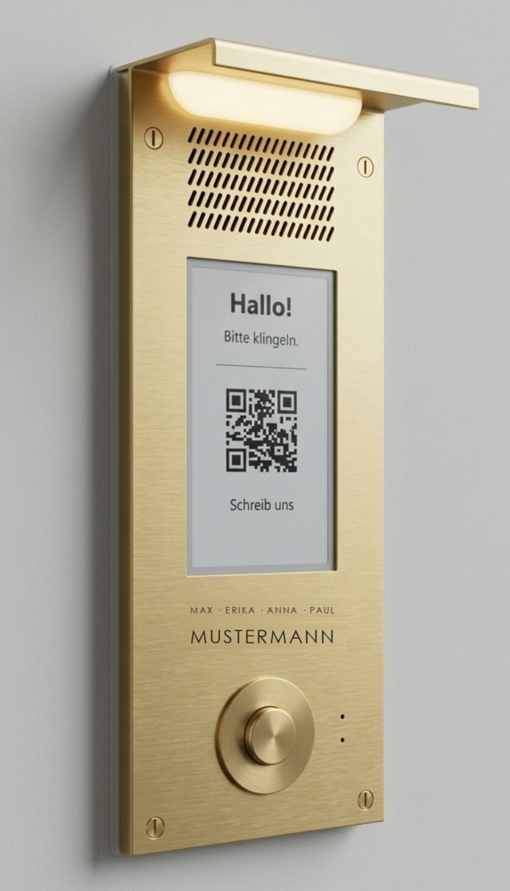

# OpenIntercom

**An open-hardware door intercom: a brass front flush in the facade, an e-paper touch screen,
two-way talk, camera and one PoE cable. Built on ESP32, ESPHome and Home Assistant. **

> Status: prototype. The parts are on the bench, the front and the box exist as 3D-printed
> prototypes. Nothing is installed at a door yet. State of this page: 01 october 2026.

  
  &nbsp;&nbsp;
  
   <em>Target design: AI-generated concept renders (Google Gemini), not photos of built devices. The engraved names are
  placeholders. Right: its counterpart in the rooms, the <a href="https://github.com/aikos-home/roomkey">RoomKey</a>.
  Both are part of <a href="https://github.com/aikos-home">aikos</a>.</em>

  

## What it is

- **A doorbell first.** A plain brass button on a supervised line: idle, pressed and a cut wire
  read as three different voltages, so a broken wire is reported instead of going silent. The
  ring reaches the phone before anything else happens at the door.
- **A screen at the door.** A 4.7" e-paper touch screen behind a window in the brass: greetings,
  notices, a QR code. It keeps its image without power and stays readable in sunlight.
- **Talk.** A microphone and a speaker behind the brass for two-way conversation, relayed
  through Home Assistant to a phone. Planned: voice messages and push-to-talk into the house.
- **One cable.** Data and power arrive over a single outdoor PoE cable. No power supply at the
  door, no switch in the box.
- **Local.** Everything runs on ESPHome and Home Assistant at home.
- **Private by design.** No camera. The microphone only opens after a visitor presses
  something, and the screen says so.

## Explore it

The [explorer](explorer/) is an interactive map of the whole system: switch wire types on and
off, tap any part for what it is and why it was chosen, and follow walkthroughs of a ring, the
power path, winter heating and a call. Download
[`explorer/dist/klingelbox-explorer.html`](explorer/dist/klingelbox-explorer.html) and open it in
a browser. A hosted version is planned.

## How it works

Three small computers share one cable and one 5 V rail, and nothing else:

| Computer | Board | Link | Job |
|---|---|---|---|
| Doorbell | Waveshare ESP32-S3-ETH (PoE module) | wired | button line, light, heater, climate sensor |
| Talk | open: an ESP32-S3 with PSRAM | WiFi | microphone, amplifier, calls |
| Screen | LilyGO T5-4.7-S3 Touch | WiFi | e-paper touch screen |

The bell runs on its own board with stock ESPHome only, so a crash or an update in the audio code
can never silence it. Details, power budget and the winter heater: [docs/architecture.md](docs/architecture.md).

## Repository

| Path | What |
|---|---|
| [`docs/architecture.md`](docs/architecture.md) | how it works, power, winter, talk, mechanics |
| [`docs/bom.md`](docs/bom.md) | what to buy, with the traps (fake "touch" listings, copper-clad cable) |
| [`docs/roadmap.md`](docs/roadmap.md) | the milestones from parts on the desk to the door, and the decisions still to lock in |
| [`docs/build-log.md`](docs/build-log.md) | what happened so far, including the dead ends |
| [`docs/family-app.md`](docs/family-app.md) | the planned self-hosted app for the household |
| [`hardware/`](hardware/) | front sheet, box and diffuser: generator scripts, STL and STEP, part drawings |
| [`explorer/`](explorer/) | the interactive map and its build |
| [`firmware/screen/`](firmware/screen/) | ESPHome firmware for the screen, with a flash-free fast refresh and a demo of what it can do |
| [`docs/screen-ux.md`](docs/screen-ux.md) | what the door screen can and cannot show, tested on the panel |
| [`tools/`](tools/) | the privacy scan that runs before every push, and bench test scripts |

The firmware for the doorbell and talk computers and the Home Assistant automations will be added
once they have passed the bench tests.

## Safety

- The surge protector only protects when it is earthed. That, and anything on 230 V, is a job
  for an electrician.
- The e-paper panel is rated 0 to +50 °C. Outdoors it needs the heater, and the heater needs
  its thermal fuse.
- Never plug a board's USB into a computer while the box's 5 V rail is live, unless the cable
  blocks power.

## Licences

- Code (scripts, explorer, firmware): [MIT](LICENSE), except the screen driver in
  `firmware/screen/components/`, which keeps its upstream licence (GPLv3 for C/C++)
- Hardware designs (CAD scripts, STL, STEP, drawings): [CERN-OHL-P-2.0](LICENSES/CERN-OHL-P-2.0.txt)
- Documentation and images: [CC BY 4.0](LICENSES/CC-BY-4.0.txt)

Designed and written with [Claude Code](https://claude.com/claude-code).
