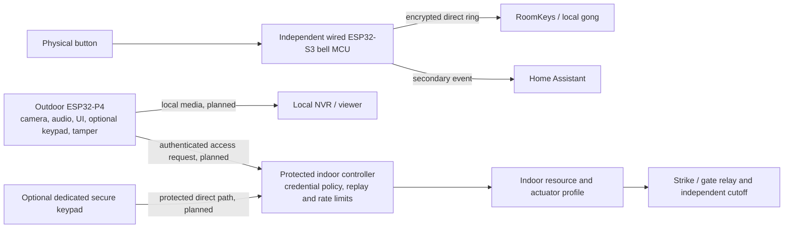

# SDLLABS Intercom

A local-first video intercom and access-control project built on [Aikos intercom](https://github.com/aikos-home/intercom). SDLLABS preserves its independent supervised bell and adds a separate ESP32-P4 multimedia path and an indoor-only access boundary. **The added media and access hardware are not deployed or validated as a complete system.**

The original Aikos design deliberately excluded cameras. This fork keeps its separation and reliability philosophy while exploring camera and audio on another processor. The physical button and direct ring never wait for video, the P4, Home Assistant, or an access decision.

## Architecture

This diagram shows intended boundaries. The inherited bell and screen have documented device bench results; the P4 is a bring-up skeleton and the indoor controller is host-tested design code.

The P4 is physically untrusted and has no relay authority. In the target design, opening or compromising the outdoor unit cannot directly energize the strike: authenticated requests are decisions for the indoor controller, which alone owns actuator wiring and timing. Home Assistant, MQTT and NVR must never expose a direct relay API. The bell does not synchronously depend on the P4. Internet, cloud, Home Assistant and NVR are not required for its direct RoomKey path; local power, a reachable LAN and a working RoomKey still are. See [architecture v2](docs/architecture-v2.md) and the [ADRs](docs/adr/).

## Independent bell and screen baseline

The inherited [Aikos bell firmware](firmware/bell/README.md) uses a supervised physical button line, approximately 1 ms sampling intent, hysteresis and cut, short and stuck-line diagnostics. Its wired ESP32-S3 sends encrypted UDP `packet_transport` rings directly to configured RoomKeys, using rolling-code behavior and press identity for duplicate handling. It publishes a Home Assistant event separately. The documented bell bench work covers line behavior and press counting; direct RoomKey behavior is implemented in the configuration, but this fork has not re-run a full system failure test. During an HA restart, direct ringing should continue when the bell, LAN and RoomKeys remain powered and reachable.

The separate [e-paper/touch screen firmware](firmware/screen/README.md) also comes from Aikos and has documented panel bench tests. It is outside the critical ring and unlock paths. The inherited [screen UX findings](docs/screen-ux.md) and [hardware/mechanical work](hardware/) remain useful, while earlier camera-free design documents describe the upstream baseline rather than this fork's target.

## P4 bench hardware and the single cable

The current P4 **bench target** is [Waveshare ESP32-P4-ETH, SKU 32086](hardware/p4/waveshare-esp32-p4-eth-32086.md). Its documented board population is ESP32-P4NRW32, 32 MiB stacked PSRAM, 32 MiB onboard NOR flash, an IP101GRI 100BASE-TX/RMII PHY, ES8311 audio codec, NS4150B speaker amplifier and a two-lane MIPI-CSI connector. The physical microSD slot is optional and unused by the current firmware. The base board offers a separate PoE module/power header; **PoE operation has not been qualified**. The actual board's PCB and silicon revisions, fitted camera module and PoE hardware still need identification on the bench. A connector or listed OV5647 compatibility does not establish that a sensor is attached.

The [ESP32-P4 Function-EV v1.5.2](firmware/p4/README.md) remains an **EOL software/bench reference BSP**, not the product board. Production board selection is open. The Waveshare profile does not inherit the Function-EV board's 16 MiB flash assumption.

The site constraint is **one outdoor CAT6/PoE feed** with both the bell S3 and multimedia P4 kept on wired Ethernet. The [current reference topology](hardware/p4/README.md) evaluates an outdoor Ethernet switch, one negotiated PoE input and protected power distribution with priority for the S3 bell rail. The Waveshare board is one Ethernet client; it does not replace that switch. Switch, PoE input, CAT6 and upstream LAN remain common-cause dependencies. This topology and bell survival under P4 power faults have not yet been physically qualified; moving the critical bell path to Wi-Fi is not the plan.

## Multimedia: capability and proof still needed

Espressif documents an ESP32-P4 Baseline H.264 hardware encoder (up to 1080p30 for the specified input), MIPI-CSI and ISP. Espressif also publishes plausible RTSP/WebRTC examples and Opus/AEC components. These establish silicon and software leads, **not streaming implemented in this repository**. The current [P4 firmware](firmware/p4/README.md) is an ESP-IDF board-abstraction and smoke-test skeleton for NOR/PSRAM reporting, ES8311 I2C address probing, and wired Ethernet link/DHCP reporting. It has no camera capture, H.264 stream, microphone capture, speaker playback, RTSP or WebRTC application.

Bench work must identify the attached camera sensor, capture frames, sustain H.264 encode, measure memory/DMA behavior, and test real microphone and speaker paths. [WP3 media research](docs/media-feasibility-research.md) outlines later RTSP/NVR and WebRTC/browser interoperability, full-duplex audio, Opus/AEC in the enclosure, latency, thermal/power limits and simultaneous NVR-plus-talk load. Those remain implementation and measurement gates.

## Indoor access-control boundary

The [ACR1 contract](protocol/access.md) defines an exact-length authenticated access request over a **confidential, authenticated transport**. It binds a provisioned principal to its transport peer, an indoor-issued short-lived one-shot challenge and an HMAC. The indoor verifier rejects replay, applies rate limiting and lockout, and checks credential scope for a bounded logical resource ID. Protected indoor policy maps that resource to an actuator profile. The outdoor client cannot supply a relay GPIO, raw output state, pulse or cutoff duration. Software safety bounds and an independent hardware maximum-on cutoff are both required; no production relay or timing profile has been selected.

One-time credentials are consumed on an authorized attempt **before physical actuation**. A later output failure does not refund that use, and a successful command does not prove the door moved. PINs must not be stored or logged in plaintext. A P4-connected keypad is a **convenience credential path** with bounded scope: a compromised P4 can observe PIN entry even if verification happens indoors. Higher-assurance credentials need a separate protected keypad/controller path directly to the indoor access controller. Keypad hardware remains open; encryption after entry cannot hide a PIN from the P4 that collected it.

The [portable access-controller core](firmware/access-controller/README.md) is **host-tested design code, not deployable access-control firmware**. Its parser, authentication, replay, rate, resource and actuator-policy state machine has passing host and ASan/UBSan tests. Actual MCU integration, confidential transport, key and credential storage, door/REX sensing, relay circuitry and the [physical cutoff](hardware/access-controller/README.md) remain to be designed and tested. Home Assistant, MQTT and NVR are orchestration or media services, never direct unlock authorities.

## Outdoor software and update rules

The P4 target uses ESP-IDF/FreeRTOS and is designed to boot firmware from onboard NOR; boot on the Waveshare board remains to be verified. Core operation must require no Linux, root filesystem, SD card, SQLite/database, Internet or cloud service. Avoiding required mutable outdoor storage also limits corruption and wear after power loss. Signed, recoverable OTA is a target architecture; the present bench partition layouts include A/B application slots, but signing, secure rollback, key provisioning and recovery have **not** been completed or validated. See [ADR-0001](docs/adr/0001-no-linux-or-sd-dependency.md).

## Current status

| Stage | Evidence in this repository | Still open |
| --- | --- | --- |
| Implemented / inherited | Aikos supervised bell sender and direct RoomKey ring configuration; e-paper/touch baseline with documented bench results; SDLLABS architecture and ADRs | Full integrated failure testing on a final enclosure/network |
| Host-tested | ACR1 portable controller core: fixed parser, HMAC/peer binding, challenge/replay, rate/lockout, resource scope and actuator policy; normal and ASan/UBSan tests pass | Deployable indoor firmware and physical safety hardware |
| Source-ready / bench target | ESP32-P4 ESP-IDF bring-up skeleton; Waveshare SKU 32086 BSP and 32 MiB NOR profile; RMII Ethernet, memory and I2C smoke paths | Target ESP-IDF build/flash and device observations |
| Research complete, implementation pending | RTSP/WebRTC strategy, Opus/AEC options and media resource worksheet | Real capture, streams, interoperability and simultaneous-load measurements |

Hardware validation remains for the P4 silicon revision, Ethernet/DHCP, camera, sustained H.264, microphone, speaker, PoE, thermal/power budget and no-SD boot. The single-CAT6 switch and protected rails must prove that S3 ringing survives P4 failure. Indoor relay, door/REX inputs and independent cutoff require separate hardware qualification. No such WP2/WP4 device acceptance is claimed here.

## Repository map and bench entry points

| Path | Owner |
| --- | --- |
| [`firmware/bell/`](firmware/bell/) | Inherited supervised ESPHome bell and direct RoomKey sender |
| [`firmware/screen/`](firmware/screen/) | Inherited e-paper/touch firmware and driver |
| [`firmware/p4/`](firmware/p4/) | ESP-IDF board support and bring-up smoke code, no media application yet |
| [`firmware/access-controller/`](firmware/access-controller/) | Portable, host-tested access verifier and actuator state machine |
| [`protocol/`](protocol/) | Access contract and planned event/intercom interfaces |
| [`hardware/`](hardware/) | Inherited mechanics plus P4 topology and indoor-controller hardware gates |
| [`docs/adr/`](docs/adr/) | Binding architecture decisions |
| [`.agent/plans/`](.agent/plans/) | Work-package execution records and remaining gates |

For the access core, run `make -C firmware/access-controller test`; its [README](firmware/access-controller/README.md) describes the host-only scope. For P4 bring-up, follow the [board-specific build procedure](firmware/p4/README.md). WP2.1 pins **ESP-IDF v5.5.4** for Waveshare. Read the real chip marking or boot log first, choose the matching silicon-revision overlay, and start with a fresh generated `sdkconfig` for that board and revision. Never bypass a revision mismatch with `--force`. The repository does not document a validated target build, flash or CI deployment pipeline for the P4.

## Provenance and licenses

[Aikos intercom](https://github.com/aikos-home/intercom) supplied the bell, direct RoomKey approach, screen work and reliability-first hardware ideas. [OpenChime](https://github.com/exddc/openchime) informs media and security research, especially its Ring H.264/WebRTC/access requirements; its Ring tree is primarily specification material, and no OpenChime repository or Linux stack was imported wholesale. The [upstream feature/provenance map](docs/upstream-map.md) distinguishes implemented source from proposals. Espressif components and documentation inform the P4 feasibility work; Waveshare documentation and schematic inform the SKU 32086 bench BSP. Respect file-level notices when adapting third-party material.

Repository code is [MIT](LICENSE) except the inherited screen driver's C/C++ files, which retain [GPLv3 terms](firmware/screen/components/lilygo_t5_47_plus/LICENSE). Hardware designs use [CERN-OHL-P-2.0](LICENSES/CERN-OHL-P-2.0.txt); documentation and images use [CC BY 4.0](LICENSES/CC-BY-4.0.txt).
