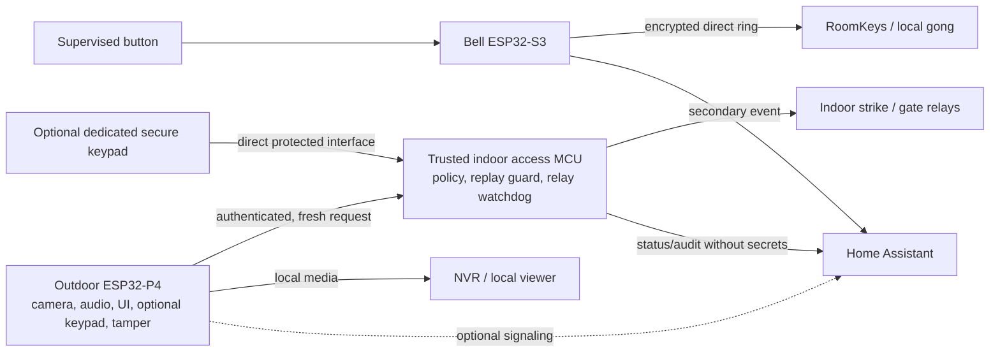

# SDLLABS Intercom architecture v2

Status: proposed architecture, 2026-10-01. This document does not claim that the P4 multimedia unit or indoor access controller exists. The inherited [architecture](architecture.md) and [roadmap](roadmap.md) describe the camera-free Aikos baseline; this document governs the SDLLABS extension. [Upstream map](upstream-map.md) records source and maturity.

## System contract

The physical button is sensed by the existing ESP32-S3 bell MCU on a supervised line. That MCU sends encrypted direct ring packets to RoomKeys and separately publishes Home Assistant events. The outdoor ESP32-P4 handles camera, audio, visitor UI, and access-request creation. A physically protected indoor MCU alone applies access policy and drives strike/gate relays. All core paths stay on the local network; Internet, cloud, HA, NVR, and media services are outside the critical ring path.



Arrows show logical data flow, not a selected transport. The bell-to-RoomKey transport already exists; new intercom and access transports remain to be specified. There must be **no outdoor relay, outdoor strike supply pair, or bypass wire that energizes an indoor relay when shorted**. Request-to-exit is a locally wired, indoor-controller input subject to its own safety policy.

## Owners and boundaries

| Component | Owns | Does not own / trust boundary |
| --- | --- | --- |
| Bell ESP32-S3, `firmware/bell/` | Supervised button, press identity, cut/short diagnostics, direct encrypted RoomKey delivery, HA event; future light/heater/environment control must preserve its safety rules | No camera, media scheduler, keypad policy, or relay. HA/P4/NVR outage cannot stop sensing or direct sending. |
| RoomKeys | Local audible ring from direct packet; duplicate suppression as described by current bell contract | No lock authority. Direct ringing still requires power, network reachability, and a working RoomKey. |
| Screen, `firmware/screen/` | Existing separate e-paper/touch firmware and UI behavior | Not in bell or unlock critical path; later physical integration is undecided. Its existing driver has separate GPLv3/MIT provenance. |
| Outdoor P4, proposed `firmware/p4/` | Board support, Ethernet, camera/codec, audio, bounded media sessions, visitor UI, optional keypad, tamper reporting, authenticated request client | Physically exposed and therefore untrusted for final policy or PIN secrecy if the keypad attaches to it. No strike/gate GPIO or relay driver. Failure cannot stop bell MCU. |
| Indoor access MCU, proposed `firmware/access-controller/` | Credential verifier and policy, request authentication/freshness/replay state, rate limiting, door/REX inputs, relay state machine and independent maximum-on cutoff, audit events | Only authority that can energize strike/gate. No dependence on P4 media, HA, MQTT, or Internet to enforce local policy. |
| HA / optional local broker or signaling | UI, notification, management workflow, orchestration | No direct relay topic/API. Management changes require indoor authorization and validation. Not required for direct ring. |
| NVR / local viewer | Recording, retention, interactive view as selected by WP3 | No effect on bell or access policy. |

The bell and P4 may share an enclosure, PoE feed, cable, and switch. Those are **common-cause dependencies**; processor isolation does not guarantee ringing after loss of shared power or LAN. WP2/hardware design must budget peak loads and preserve bell power priority, and WP5 must test power/network faults. A local audible RoomKey also needs its own power and reachable network. No claim of autonomous ringing without those prerequisites is made.

### One outdoor CAT6 feed, two wired Ethernet devices

The target has one outdoor CAT6/PoE feed but requires wired Ethernet for both the independent bell ESP32-S3 and multimedia ESP32-P4. WP2 must resolve the outdoor network and power topology before selecting a board or assuming both devices can attach. Evaluate an internal Ethernet switch with suitable PoE splitting/power distribution, or an equivalent topology that gives each MCU its own wired connection and preserves bell power priority. Account for switch startup, brownout, surge, thermal and total PoE load as shared failure modes. Do not silently move the critical bell path to Wi-Fi; any alternative must retain its wired direct RoomKey delivery and be reviewed against [ADR-0003](adr/0003-independent-bell-failure-domain.md).

## Data and control flows

1. **Ring:** supervised line → bell press detection → encrypted UDP `packet_transport` to configured RoomKeys, concurrently with an HA event. Preserve the existing `(boot_id, presses)` identity, `ringing` state, rolling-code setting, 1 ms sampling intent, hysteresis, diagnostics, and ring cap. The bell's HA API uses `reboot_timeout: 0s`. Screen/media may react to a derived event but must never gate it.
2. **Intercom:** ESP32-P4 silicon has a [documented Baseline H.264 encoder rated up to 1080p30, plus MIPI-CSI and ISP](https://www.espressif.com/sites/default/files/documentation/esp32-p4_datasheet_en.pdf). That rating does not prove a selected board, sensor/driver or complete stream. WP2 validates the actual capture/encode and Ethernet/audio hardware. WP3 owns local streaming to an authorized viewer or NVR, RTSP/WebRTC roles, Opus/AEC, end-to-end latency, resource budget and restart behavior. Loss of any media task sheds media only.
3. **Access:** a P4-connected visitor input, if selected, produces an authenticated, confidential request to the indoor MCU; a dedicated secure keypad could instead communicate directly with that MCU. The controller performs strict parsing, source/authentication and freshness/replay verification, credential/policy and rate limiting before a bounded relay pulse and secret-free audit result. The request identifies a proposed action and bounded logical resource. Protected indoor policy maps that resource to an actuator and timing profile and checks credential scope; the request never supplies GPIO, relay state, pulse or cutoff duration. P4 compromise can submit attempts within its assigned capability, so indoor policy and lockout must remain effective. The controller rejects requests when time/challenge/replay state is uncertain.
4. **Local exit:** a physically protected request-to-exit input goes directly to indoor controller policy. Door contact distinguishes closed/open and, where sensors permit, held-open/forced-open. Tamper generates an event and may tighten policy; it never unlocks.
5. **Administration/update:** configuration and OTA are separate from critical runtime. Each device needs recoverable update behavior, boot health checks and independent deployment. No update or reset may leave relays energized. Outdoor firmware boots from on-board NOR without a required SD card, database, or writable system filesystem.

## Access boundary requirements for WP4

`protocol/access.md` must define a versioned, length-bounded message and exact principal, action, device, request ID, validity, nonce/counter or challenge binding, and authentication semantics. The indoor controller must authenticate before actuation, reject malformed/expired/replayed requests, limit attempts across P4 resets, and persist only the minimum durable replay/credential state. A controller-issued short-lived challenge can avoid trusting P4 clocks and high-frequency counter writes; its boot/restart and packet-loss behavior needs explicit tests. A protected local key store/provisioning and rotation procedure is required. Never log or persist plaintext PINs; use an MCU-appropriate verifier, bounded temporary validity/uses and revocation. Caller ID alone is never a main-door credential. Network VLAN rules reduce exposure but are not authentication.

If a keypad attaches to the physically untrusted P4, that processor can observe PIN entry. Indoor PIN verification prevents direct relay compromise; it does **not** keep the PIN secret from a compromised P4. Two assurance models remain open: (a) a P4-connected keypad for convenience credentials with bounded scope, validity, uses and revocation; or (b) a dedicated secure keypad/controller with a direct protected interface to the indoor access controller for higher-assurance credentials, so the PIN need not pass through the P4. The dedicated path still needs its own physical tamper and channel-security design. Neither model or its hardware is selected. WP4 must state which credential classes each model can authorize, and must not treat transport encryption after P4 capture as PIN secrecy from the P4.

Every relay defaults de-energized at power-up, reset, crash and authentication failure. Protected indoor configuration sets per-resource actuator profiles; hard software bounds and a physically independent maximum-on cutoff are both required. Actual production timing, actuator polarity, egress/fire rules, REX behavior and fail-secure mechanics need a qualified hardware review before implementation. An HA compromise must not become a direct relay command path.

| Threat | Required boundary or later proof |
| --- | --- |
| Opened front panel, shorted cable, spoofed tamper, compromised P4 | No reachable actuator wiring; tamper is event-only; indoor verifier still enforces rate limits and policy. |
| LAN attacker or replayed/malformed packet | Authenticated protected channel/message, strict bounded parser, short validity, replay state and rejection tests. VLAN policy is defense in depth. |
| Guessed/stolen PIN, compromised P4 keypad path, or caller-ID spoofing | Indoor lockout/backoff, revocation and bounded temporary credentials; no plaintext PIN logs/storage. A P4-connected PIN can be observed by P4, so reserve higher-assurance credentials for a separate direct keypad model if required. Caller ID needs another factor. |
| HA compromise | No HA-to-relay path; controller validates any authorized administrative change independently. |
| OTA power loss or controller reset | Rollback or known-good boot; outputs default off and independent maximum-on cutoff. |
| Relay driver/contact stuck on | Independent cutoff limits commanded energization; welded contacts and egress/fire behavior require hardware design and qualification. |

## Failure behavior to validate

| Failure | Physical ring / direct gong | Media | Access |
| --- | --- | --- | --- |
| HA or Internet unavailable | Bell still sends direct RoomKey ring if local power/LAN/RoomKey remain | Local service dependent | Indoor local policy remains; management may be unavailable |
| NVR or optional broker unavailable | Direct RoomKey ring remains | Recording or broker-dependent sessions fail | Indoor access protocol must not require broker |
| P4/media task crash | Bell and direct send remain | Unavailable or degraded | Outdoor keypad unavailable; indoor REX remains |
| Camera/audio failure | Bell and direct send remain | Affected modality unavailable | Controller policy can remain available |
| Bell MCU failure | No button sensing or direct send; offline fault must be surfaced | May remain | May remain |
| Indoor controller failure | Bell and direct send remain | May remain | No remote unlock; relays de-energize |
| SD absent | No effect | P4 must boot and operate | No effect |
| Shared PoE/switch or RoomKey failure | Ring delivery may fail; diagnose common-cause outage | Likely unavailable | Depends on separately powered/wired indoor controller |

This is a target failure contract, not test evidence. HA notifications and direct physical ringing are distinct outputs. In particular, a RoomKey or network outage prevents a remote gong even while the bell senses a press.

## Proposed repository and module boundaries

The paths below are planned, not created by WP1. Keep inherited bell/screen trees in place.

```text
firmware/
  bell/                     existing Aikos supervised line and direct ring; isolate changes
  screen/                   existing e-paper component and UI
  p4/
    boards/                 pin map, power/PHY/camera/audio variants only
    components/
      net/                  Ethernet and bounded network I/O
      video/                capture, codec, stream producer
      audio/                capture, playback, AEC boundary
      intercom/             session/signaling adapter, no bell semantics
      ui/                   keypad/display/tamper input and presentation
      access_client/        request creation and authenticated transport, no relay API
      health/               watchdog, fault and update hooks
  access-controller/
    boards/                 relay/input pins and electrical safety configuration
    components/
      access_transport/     framing and peer/session authentication
      verifier/             strict parser, freshness/replay, credential policy/rate limit
      door_state/           contact, held/forced state, REX
      actuator/             relay state machine and watchdog interface
      audit/                bounded, secret-free events
protocol/
  events.md                 versioned non-authoritative event/status vocabulary
  access.md                 sole remote access-request contract; WP4 owns
  intercom.md               media/session contract; WP3 owns
hardware/
  p4/                       board, power, thermal, camera/audio and wiring assumptions
  access-controller/        protected enclosure, relays, cutoff, REX, door and optional keypad wiring
docs/adr/                   binding architecture decisions
```

Dependency direction: board adapters → product components → versioned protocol contracts. `access_client` cannot include actuator headers; `actuator` consumes only a decision produced after verification. Media and UI code cannot import bell internals or add a synchronous step to the bell press path. Any copied third-party code needs a file-level provenance and license review before integration.

## Open decisions and hardware assumptions

WP2 has a [Waveshare ESP32-P4-ETH SKU 32086 bench profile](../hardware/p4/waveshare-esp32-p4-eth-32086.md), while product hardware selection remains open. WP2 must measure the exact received board/revision, attached camera sensor/driver, Ethernet/PoE and single-CAT6 two-device topology, PSRAM/NOR and OTA partitions, audio path, and power budget. The H.264 silicon feature is documented; actual board capture/encode remains unverified. WP3 must establish end-to-end NVR and interactive streaming, RTSP/WebRTC, Opus/AEC, latency and resource budgets on that hardware. WP4 must settle controller MCU, keypad assurance model, protected key storage, cryptography, clock/challenge model, durable anti-replay state, actuator polarity/cutoff, and door/REX wiring. Screen integration, precise enclosure thermal behavior, shared-rail isolation, and local gong power need bench validation. No keypad hardware is selected.

## Decisions

- [ADR-0001: No Linux or SD dependency](adr/0001-no-linux-or-sd-dependency.md)
- [ADR-0002: Indoor-only relay authority](adr/0002-indoor-only-relay-authority.md)
- [ADR-0003: Independent bell failure domain](adr/0003-independent-bell-failure-domain.md)
- [ADR-0004: Selective OpenChime port policy](adr/0004-selective-openchime-port-policy.md)

## Follow-up work packages

After WP1, independent agents can work in separate directories:

1. **WP2 P4 bring-up — `firmware/p4/`, `hardware/p4/`:** select an exact ESP32-P4 board and NOR partition layout; resolve two wired Ethernet devices behind one outdoor CAT6/PoE feed, evaluating an internal switch/power distribution or equivalent; validate selected camera sensor/driver, H.264 capture/encode, Ethernet/PoE, PSRAM/NOR and audio path without SD. Document power and common-cause behavior; distinguish builds from hardware tests.
2. **WP4 access protocol/controller — `protocol/access.md`, `firmware/access-controller/`, `hardware/access-controller/`:** specify principal/credential policy, keypad assurance options and challenge or counter model, then implement a strict host-testable verifier, replay/expiry/lockout tests and a safe controller skeleton with independent relay cutoff interface. Require an indoor-only actuator review before hardware drive; do not select keypad hardware yet.
3. **WP3 media feasibility — `protocol/intercom.md`, `docs/`:** begin source/library research in parallel; choose transport/prototype after WP2 confirms the board capture/encode, memory, network and audio path. Own end-to-end NVR streaming, RTSP/WebRTC, Opus/AEC, latency and resource budgets.
4. **WP5 integration/QA — `protocol/events.md`, `docs/`, CI:** after interfaces settle, build the failure matrix and CI/integration guide; test direct RoomKey ring with HA down and P4/media failure, plus controller/broker/NVR/Internet/SD absence. Record shared-power and hardware-only gaps explicitly.
